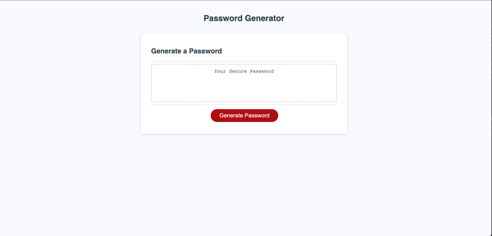

# Password Generator Tool 

The objective of this project is to learn how to refactor the code that has been provided so that the website can help generate a random password that meets the following criteria:
** is of length between 8 and 128 characters
** includes (when selected) upper case letters, lower case letters, numericals, and special characters. 
** and the password that is generated fulfills the previously stated criteria.

Here is a screenshot of my deployed code:

Here is the URL to my website:
https://nbwong1.github.io/password_generator_tool/

## How to use my project
You can use this project to create a password for yourself, once I have completed my code.

## Credits
I would like to give credit to my instructor, TAs, the ToP, and my wife. 
